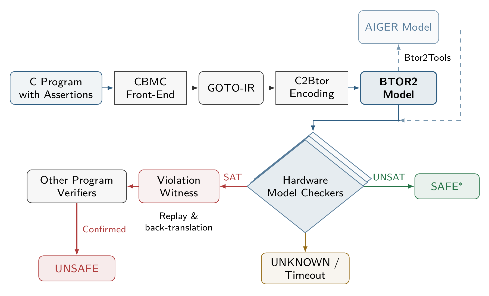

# C2BTOR 2.0

[English](README.md) · [简体中文](README.zh-CN.md)

## 1. C2BTOR framework

C2BTOR 是一个基于硬件模型检测的 C 程序验证框架。它通过 [CBMC](https://github.com/diffblue/cbmc) 前端将带有断言的 C 程序转换为 Goto-IR，再生成 BTOR2 状态迁移模型，交给不同的硬件模型检测器搜索反例或证明安全性质。



**SAFE\*** 要求无界算法证明全部选中性质和模型边界义务；有界搜索无反例不代表 SAFE。

## 2. 依赖与安装

本次源码发布面向 **Linux x86-64**。构建目标与可执行文件均为 **`c2btor`**，产品版本为 **`2.0.0`**。源码基线为 `westtide/cbmc` 的 `2.0` 标签，提交 `4b94c0095bfe08bfed221cb7665a225a28d18eb8`。仓库不提供预编译转换器或 checker。

- **构建**：C++17 编译器、CMake 3.8+、Make 或 Ninja、Flex、Bison、Git、Bash 和 `patch`。默认 CMake 配置会下载并打补丁构建 MiniSat。
- **转换**：C 预处理器，例如 GCC。仅生成模型时不需要模型检测器。
- **验证**：按各工具说明单独安装 BTOR2 后端，例如 rIC3、Pono 或 BtorMC，并确认其数组支持、属性处理与反例格式适合当前模型。
- **反例验证（可选）**：Python 3.10+、[Btor2Tools](https://github.com/hwmcc/btor2tools) 和 [CPAchecker](https://github.com/sosy-lab/cpachecker)。单任务 witness wrapper 只使用 Python 标准库；批量脚本 `scripts/run_witness_svcomp.py` 另需 PyYAML。

Ubuntu/Debian 示例：

```sh
sudo apt-get update
sudo apt-get install build-essential cmake ninja-build flex bison patch git
git clone https://github.com/westtide/c2btor.git
cd c2btor
cmake -S . -B build -G Ninja -DWITH_JBMC=OFF -DCMAKE_BUILD_TYPE=Release
cmake --build build --target c2btor -j4
build/bin/c2btor --version
```

在仓库根目录运行命令。本仓库未包含 JBMC，因此保持 `WITH_JBMC=OFF`；内存较小时降低 `-j4`。可执行文件为 `build/bin/c2btor`。默认依赖下载需要网络；若系统已安装 MiniSat 的头文件和库，可在新的构建目录配置 `-Dsat_impl=system-minisat2`。

需要本地安装时可执行：

```sh
cmake --install build --component c2btor --prefix /path/to/install
```

## 3. 支持的硬件模型检测器

| 工具                                                                                           | 输入路径       | 说明                                                   |
| ---------------------------------------------------------------------------------------------- | -------------- | ------------------------------------------------------ |
| [rIC3](https://github.com/gipsyh/rIC3)                                                          | BTOR2 / AIGER  | IC3、BMC 等；仓库提供运行脚本                          |
| [Pono](https://github.com/stanford-centaur/pono)                                                | BTOR2          | 多种 SMT 模型检测算法；按工具官方说明运行                |
| [BtorMC](https://github.com/Boolector/boolector)                                                | BTOR2          | 有界模型检测；标准反例已用于回放验证                   |
| [AVR](https://github.com/aman-goel/avr)                                                         | BTOR2          | 格式兼容后端；C2BTOR 的端到端 witness 路径尚未独立验证 |
| [SimpleCAR](https://github.com/lijwen2748/simplecar)、[ABC](https://github.com/berkeley-abc/abc) | BTOR2 → AIGER | 位级模型检测；使用纯 BV 编码并安装转换器               |

具体模型的数组、属性数量及反例格式需与所选后端匹配。其他兼容 BTOR2/AIGER 的检测器也可接入。

## 4. 使用参数与命令

### 转换 C 程序

检查程序自身断言的常用命令：

```sh
mkdir -p work
build/bin/c2btor program.c --goto-btor2 --inline --64 \
  --goto-btor2-out work/model.btor2 \
  --goto-btor2-map-out work/model.map.json \
  --memory object --array bv \
  --no-standard-checks --no-pointer-check \
  --no-bounds-check --no-built-in-assertions
```

将 `program.c` 换成实际源文件。ILP32 任务选择 `--32`，Linux LP64 任务选择 `--64`；它们描述 C 程序的目标数据模型，不是本机可执行文件的位数。`--inline` 展开普通辅助函数调用。上述 `--no-*` 关闭 CBMC 自动加入的检查，保留源程序断言；C2BTOR 自身的内存有效性与模型边界诊断仍然存在。

安装 Btor2Tools 后可运行 `catbtor work/model.btor2` 检查语法和类型。生成模型、parser 通过，都不等于源程序已经证明安全。

### 参数说明

参数值用空格传入，例如 `--memory object`。BTOR2 编码和属性选项配合 `--goto-btor2` 使用。

| 参数 | 含义与用途 |
| --- | --- |
| `--goto-btor2` | 启用 C 到 BTOR2 转换。 |
| `--goto-btor2-out FILE` | 将模型保存到文件；省略时输出到 stdout。 |
| `--goto-btor2-map-out FILE` | 保存模型/GotoIR/C 源码位置、属性信息与模型验证义务。映射文件应与模型文件不同。 |
| `--memory object` / `--memory global` | 每个对象独立存储，或使用统一全局内存。默认 `object`。 |
| `--array bv` / `--array array` | 使用位向量，或 BTOR2 Array 的 read/write 存储。默认 `bv`；数组编码需要后端支持数组。 |
| `--memory-object-max-bytes N` | 在 object 模式中显式限制运行时对象容量；默认从最终 GotoIR 推导。超出容量属于模型边界，不是 malloc 失败。 |
| `--array-bv-max-object-bytes N` | 限制 BV 存储的运行时容量；object/BV 模式下若同时指定两个容量参数，数值必须一致。 |
| `--goto-btor2-heap-objects K` | 限制总成功动态分配次数，默认 `32`。释放对象不会归还其身份预算。 |
| `--malloc-may-fail --malloc-fail-null` | 包含动态分配失败并返回 NULL 的分支。 |
| `--goto-btor2-checks` | 编码前插入所选 CBMC 安全检查；配合 `--bounds-check`、`--pointer-check` 或 `--div-by-zero-check` 等使用。 |
| `--goto-btor2-error-function NAME` | 在内联前把指定错误函数调用标记为 unreach-call 属性；配合 `--inline`。 |
| `--goto-btor2-reach-only` | 只选择该错误函数对应的源属性；必须同时指定 `--goto-btor2-error-function NAME`。 |
| `--goto-btor2-merge-bads` | 将选中的源断言 bad 用 OR 合并为一个；别名为 `--goto-btor2-merge-properties`。辅助诊断单独处理。 |
| `--goto-btor2-no-heap-guards` | 隐藏辅助内存/模型边界 bad 报告，但保留路径冻结和验证义务；仅源属性 UNSAT 不能证明隐藏义务已满足。 |

固定对象按实际大小编码。运行时对象的容量有限，在生成模型时规划，求解时不会动态扩容。例如，只请求数组越界插桩时，可组合 `--no-standard-checks --bounds-check --goto-btor2-checks`。

### 检查错误函数可达性

输入程序实际定义/调用 `reach_error` 时，可用以下命令选择其可达性属性：

```sh
build/bin/c2btor program.c --goto-btor2 --inline --64 \
  --memory object --array bv \
  --goto-btor2-error-function reach_error \
  --goto-btor2-reach-only --goto-btor2-merge-bads \
  --goto-btor2-out work/reach.btor2 \
  --goto-btor2-map-out work/reach.map.json \
  --no-standard-checks --no-pointer-check \
  --no-bounds-check --no-built-in-assertions
```

命令会合并选中的源属性。后端只接受单个 bad 时，可再加 `--goto-btor2-no-heap-guards` 隐藏辅助 bad，但给出 C 安全结论前仍需检查对应义务。有界搜索没有反例不等于无界 SAFE；TIMEOUT 和 UNKNOWN 均表示尚无安全结论。

### 导出绑定源码哈希的映射

为同一个 `reach_error` 程序准备 witness 回译输入：

```sh
cat > work/reach.prp <<'EOF'
CHECK( init(main()), LTL(G ! call(reach_error())) )
EOF
python3 scripts/c2btor_witness.py export \
  --c2btor build/bin/c2btor --program program.c --spec work/reach.prp \
  --output-dir work/witness-export -- --64
```

最终输出目录必须尚不存在。export 只生成模型及绑定源码/模型哈希的映射，不运行求解器，也不生成反例。维护的反例流程为：标准 BTOR2 witness → BtorSim 回放 → SV-COMP violation YAML 2.0 → CPAchecker 确认。内存有效性和模型边界轨迹与源错误调用违例分别分类。SAFE 不生成 invariant witness。

完整接口可运行 `build/bin/c2btor --help` 和 `python3 scripts/c2btor_witness.py --help` 查看。转换回归脚本保留在 `regression/goto-btor2/`；按各脚本的 `--help` 传入独立安装的外部工具。

### 适用范围

主要面向从 `main` 开始执行的顺序 C 程序，支持内联后的普通函数调用、机器整数、已实现的 binary32/binary64 浮点操作，以及有限对象内存。递归调用栈、并发、无界堆和部分 C 内存操作仍不支持。CBMC 前端能解析的程序，不一定都能被 C2BTOR 编码。

## 5. 致谢与许可

**C2BTOR 基于 CBMC 构建。** 感谢 Daniel Kroening、Edmund Clarke、CBMC/CProver 作者及所有上游贡献者提供 C 前端、GotoIR、目标机器配置与程序变换，使本框架得以实现。参考 [CBMC 源码仓库](https://github.com/diffblue/cbmc)及[官方文档](https://diffblue.github.io/cbmc/)。

同时感谢 Btor2Tools、各硬件模型检测器及 CPAchecker 的作者与维护者。

迁入源码保留 [4-clause BSD 许可](LICENSE)和各文件自己的声明。[LICENSE.c2btor](LICENSE.c2btor) 保存目标仓库原有 BSD 3-Clause 声明，不替代上游许可条件。上游二进制读取测试的输入夹具仍保留，它们不是预编译转换器/checker 的发布产物。

> This product includes software developed by Daniel Kroening,
> Edmund Clarke,
> Computer Science Department, University of Oxford,
> Computer Science Department, Carnegie Mellon University.
